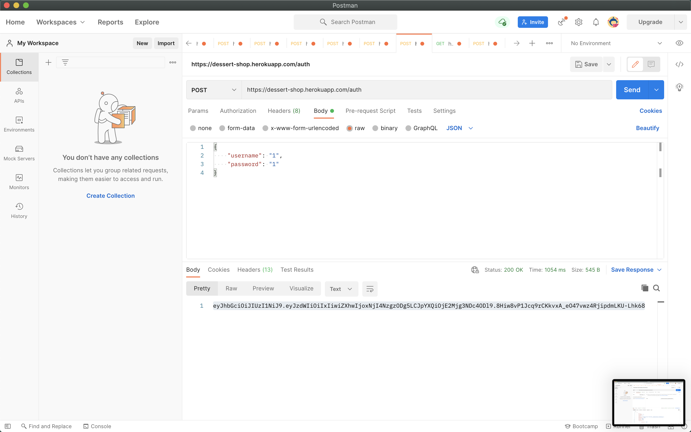
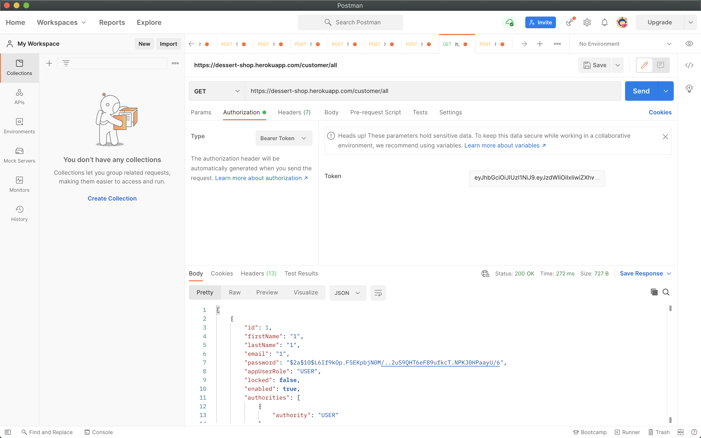
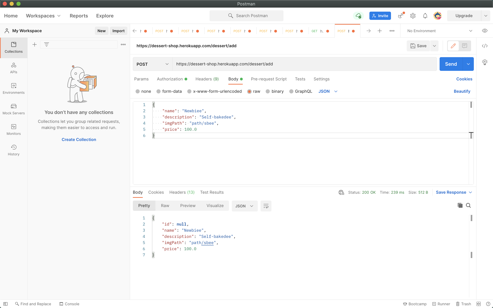
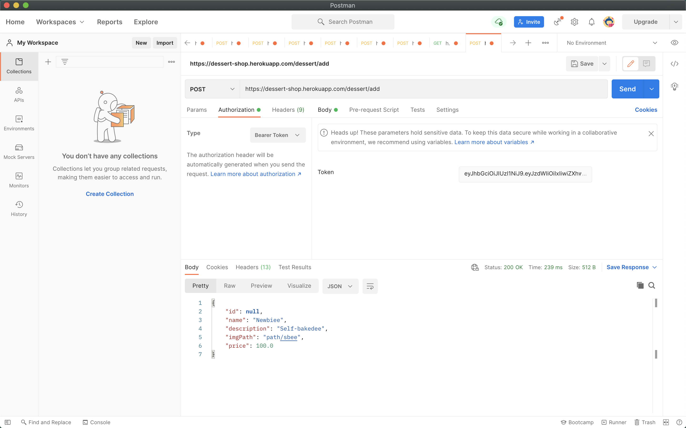

# ACapOfJoy

## Author: Ainazik Momunalieva COM-19 A
<!-- TABLE OF CONTENTS -->

  
Table of Contents

  <ol>
    <li>
      <a href="#about-the-project">About The Project</a>
      <ul>
        <li><a href="#built-with">Built With</a></li>
      </ul>
    </li>
    <li>
      <a href="#heroku-link">Heroku link</a>
    </li>
    <li><a href="#swagger-documentation">Swagger Documentation</a></li>
    <li><a href="#screenshots">Screenshots</a></li>
    <li><a href="#contact">Contact</a></li>
  </ol>

## About the project
Backend system for a cafetheria of desserts and drinks. All API endpoints are secured. There is a user registration and authorisation. There are two roles: Admin and client. Authentication is set up in configurations. 

### Stack of Technologies
* Java
* SpringBoot
* Spring Security
* Java Persistance API (JPA)
* Hibernate
* Spring MVC
* PostgreSQL
* REST API
* Swagger
* JWT
* Docker
* Heroku
 

## Heroku Link
<ul>
  <li><a href="https://dessert-shop.herokuapp.com">Go to page</a></li>
</ul>

## Swagger Documentation
<ul>
  <li><a href="https://dessert-shop.herokuapp.com/swagger-ui.html#/">Api Documentation</a></li>
</ul>

## Screenshots
### User Authentication
 
  

 
### GET (with jwt token)

  

### POST Body

  

### POST Authorization

  

## Contact

Ainazik - [@Ainazik06724234](https://twitter.com/Ainazik06724234) - ainazik.momunalieva@iaau.edu.kg

